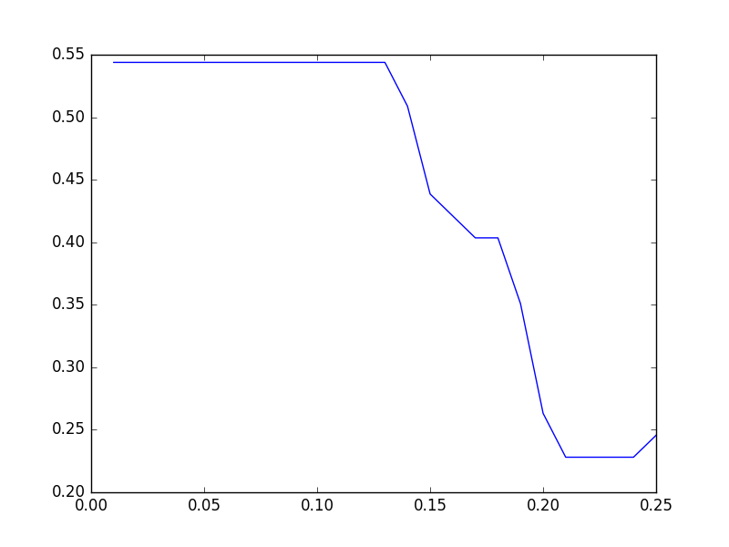

Tutorial
=============
.. raw:: html

   

In this tutorial, we will run Fraud Eagle algorithm [#ICWSM13]_ on a synthetic
data set provided in [#DEXA11]_.

Installation
------------------
:ref:`fraud-eagle:top`, ``rgmining-fraud-eagle``, is available in `PyPI <https://pypi.python.org/pypi/rgmining-fraud-eagle>`__.
:ref:`synthetic:top`, ``rgmining-synthetic-dataset``, is also available in
`PyPI <https://pypi.python.org/pypi/rgmining-synthetic-dataset>`__.
At first, we need to install both packages via ``pip``.

.. code-block:: shell

   pip install --upgrade rgmining-fraud-eagle rgmining-synthetic-dataset

Constructing a review graph
----------------------------
``rgmining-synthetic-dataset`` has ``synthetic`` package which exports
function :func:`synthetic.load() <synthetic.loader.load>` and constant :data:`synthetic.ANOMALOUS_REVIEWER_SIZE`.
The function :func:`synthetic.load() <synthetic.loader.load>` loads the synthetic data set and adds them
to a review graph.
Constant :data:`synthetic.ANOMALOUS_REVIEWER_SIZE` represents how many anomalous
reviewers the data set has and it's :math:`57`.
Every anomalous reviewer has ``anomaly`` in their name.

Let us omit to explain how to construct the synthetic data set.
If you are interested in that, please read
`the original article <http://www.anrdoezrs.net/links/8186671/type/dlg/http://link.springer.com/chapter/10.1007%2F978-3-642-23088-2_25>`_.

In order to make a review graph object of Fraud Eagle algorithm and load
the synthetic data set, run

.. code-block:: python

  import fraud_eagle as feagle
  import synthetic

  graph = feagle.ReviewGraph(0.10)
  synthetic.load(graph)

where, :math:`0.10` is a parameter of Fraud Eagle.
See :class:`fraud_eagle.ReviewGraph <fraud_eagle.graph.ReviewGraph>` for more information.

Running Fraud Eagle algorithm
-------------------------------
Since Fraud Eagle takes one parameter,
we have a question that which value is the best one to determine anomalous reviewers.
In this tutorial, we evaluate each parameter with precision of top-57 anomalous reviewers,
i.e. how many actual anomalous reviewers appear in top-57 highest anomaly reviewers.

To evaluate one parameter, we make a simple script ``analyze.py``:

.. code-block:: python

  #!/usr/bin/env python
  import click
  import fraud_eagle as feagle
  import synthetic

  @click.command()
  @click.argument("epsilon", type=float)
  def analyze(epsilon):
      graph = feagle.ReviewGraph(epsilon)
      synthetic.load(graph)

      for _ in range(100):
          diff = graph.update()
          print("Iteration end: {0}".format(diff))
          if diff < 10**-4:
              break

      reviewers = sorted(
          graph.reviewers,
          key=lambda r: -r.anomalous_score)[:synthetic.ANOMALOUS_REVIEWER_SIZE]

      print(len([r for r in reviewers if "anomaly" in r.name]) / len(reviewers))

  if __name__ == "__main__":
      analyze()

Note that the above script uses a command-line parser `click`_.

With this script, to evaluate a parameter, e.g. :math:`0.1`, run:

.. code-block:: shell

  $ chmod u+x analyze.py
  $ ./analyze.py 0.1

The result might be :

.. code-block:: shell

  $ ./analyze.py 0.10
  Iteration end: 0.388863491546
  Iteration end: 0.486597792445
  Iteration end: 0.679722652169
  Iteration end: 0.546349261422
  Iteration end: 0.333657951459
  Iteration end: 0.143313076183
  Iteration end: 0.0596751050403
  Iteration end: 0.0265415183341
  Iteration end: 0.0109979501706
  Iteration end: 0.00584731865022
  Iteration end: 0.00256288275348
  Iteration end: 0.00102187920468
  Iteration end: 0.000365458293609
  Iteration end: 0.000151984909839
  Iteration end: 4.14654814812e-05
  0.543859649123

It means about 54% reviewers in the top-57 anomaly reviewers are
actual anomalous reviewers.

Parallel evaluation
---------------------
We need to evaluate several parameters with ``analyze.py`` to determine the best one.
Since it seems taking long time,
We employ `Google Cloud Platform <https://cloud.google.com/>`_ and
`Roadie <https://jkawamoto.github.io/roadie/>`__ for parallel evaluation.

To use the Google Cloud Platform, you need to register it.
After registration, setup `Google Cloud SDK <https://cloud.google.com/sdk/>`_
and `Roadie <http://jkawamoto.github.io/roadie/documents/installation/>`__.

In order to run ``analyze.py`` on another environment,
we need to prepare ``requirements.txt``, which is a list of related libraries,
in the same directory as ``analyze.py``:

.. code-block:: text

  click==6.6
  rgmining-fraud-eagle==0.9.2
  rgmining-synthetic-dataset==0.9.0

Roadie requires a configuration file which is written in YAML and specifies programs to be run on a cloud server.
We make ``analyze.yml`` and just specify to run ``analyze.py``:

.. code-block:: yaml

  run:
  - python analyze.py {{epsilon}}

where `{{epsilon}}` is a placeholder and we will give several values for it.

At first, we upload our source code and make an instance on the cloud with parameter :math:`0.01`.

.. code-block:: shell

  roadie run --local . --name feagle0.01 --queue feagle -e epsilon=0.01 analyze.yml

where ``--local .`` means the root of our source code is the current directory,
and ``--queue feagle`` means the new task belongs to a set of tasks named ``feagle``.

Next, we make instances with other parameters.
Those instances use same source code uploaded with the instance named ``feagle0.01``,
and the code to create such instances is as follows:

.. code-block:: shell

  $ for i in `seq -w 2 25`; do
      roadie run --source "feagle0.01.tar.gz" --name "feagle0.${i}" --queue feagle -e "epsilon=0.$i" analyze.yml
  done

By default, Roadie creates one instance for a set of tasks.
We need more instance to run tasks in parallel and create 7 more instances:

.. code-block:: shell

  $ roadie queue instance add --instances 7 feagle

and ``roadie status`` shows current status of every instance,
which has a name starting with the queue name and a random number.
If ``roadie status`` shows nothing, all tasks have done.

The results are stored in Google Cloud Storage and
``roadie result show <task name>`` shows the result of a task.
To download them in a CSV file, run

.. code-block:: shell

  $ for i in `seq -w 1 25`; do
      echo "0.${i}, `roadie result show feagle0.${i} | tail -1`" >> result.csv
  done

We now create a simple script, ``plot.py``, to plot the results:

.. code-block:: python

  #!/usr/bin/env python
  import click
  from matplotlib import pyplot
  import pandas as pd

  @click.command()
  @click.argument("infile")
  def plot(infile):
      data = pd.read_csv(infile, header=None)
      pyplot.plot(data[0], data[1])
      pyplot.show()

  if __name__ == "__main__":
      plot()

The above script requires,
`click`_,
`matplotlib <http://matplotlib.org/>`_,
and `pandas <http://pandas.pydata.org/>`_.

After running the script by

.. code-block:: shell

  $ chmod u+x plot.py
  $ ./plot.py result.csv

we get the following graph, where x-axis means parameter values
and y-axis means precision.

From the graph, the parameter should be less than :math:`0.1`.

References
------------

.. [#ICWSM13] `Leman Akoglu <http://www.andrew.cmu.edu/user/lakoglu/>`_,
    Rishi Chandy, and `Christos Faloutsos <http://www.cs.cmu.edu/afs/cs/usr/christos/www/>`_,
    "|pdf| `Opinion Fraud Detection in Online Reviews by Network Effects
    <https://www.aaai.org/ocs/index.php/ICWSM/ICWSM13/paper/viewFile/5981/6338>`_,"
    Proc. of `the 7th International AAAI Conference on WeblogsS and Social Media
    <http://www.icwsm.org/2013/>`_ (ICWSM 2013), Boston, MA, July, 2013.

.. [#DEXA11] Kazuki Tawaramoto, `Junpei Kawamoto`_, `Yasuhito Asano`_, and
    `Masatoshi Yoshikawa`_, "|springer| `A Bipartite Graph Model and Mutually Reinforcing
    Analysis for Review Sites
    <http://www.anrdoezrs.net/links/8186671/type/dlg/http://link.springer.com/chapter/10.1007%2F978-3-642-23088-2_25>`_,"
    Proc. of `the 22nd International Conference on Database and Expert Systems
    Applications <http://www.dexa.org/previous/dexa2011/index.html>`_ (DEXA 2011),
    pp.341-348, Toulouse, France, August, 2011.

.. _Junpei Kawamoto: https://www.jkawamoto.info
.. _Yasuhito Asano: http://www.iedu.i.kyoto-u.ac.jp/intro/member/asano
.. _Masatoshi Yoshikawa: http://www.db.soc.i.kyoto-u.ac.jp/~yoshikawa/
.. _click: http://click.pocoo.org/

.. |pdf| raw:: html

    <i class="fa fa-file-pdf-o" aria-hidden="true"></i>

.. |springer| image:: img/springer.png
